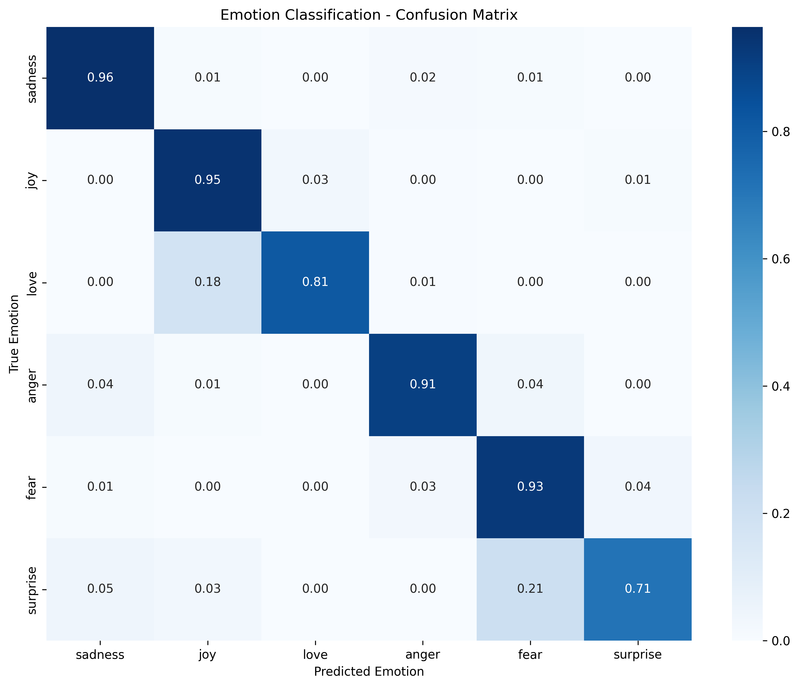

# Emotion Detection Project

This project implements a comprehensive text-based emotion recognition system using transformer models (BERT/RoBERTa). It can classify text into six emotions: **sadness**, **joy**, **love**, **anger**, **fear**, and **surprise**.

> **⚠️ Important**: The trained model is not included in this repository due to size constraints (438MB). You'll need to train the model first before using it for predictions.

## 🎯 Features

- **Multiple Model Support**: BERT, RoBERTa, DistilBERT
- **Complete Pipeline**: Data loading, preprocessing, training, evaluation, and inference
- **GPU/CPU Support**: Automatically detects and uses available hardware (including Apple Silicon MPS)
- **Comprehensive Evaluation**: Accuracy, F1-score, confusion matrices, and detailed reports
- **Easy-to-Use Interface**: Simple API for predictions on new text
- **Visualization**: Training metrics, emotion distributions, and confusion matrices
- **Batch Processing**: Handle multiple texts efficiently

## 📋 Requirements

- Python 3.7+
- PyTorch 1.9+
- Transformers 4.15+
- Datasets 1.18+
- Scikit-learn 1.0+
- NumPy, Pandas, Matplotlib, Seaborn
- Internet connection (for downloading dataset and pre-trained models)

## 🚀 Quick Start

### 1. Clone and Setup

```bash
# Clone the repository
git clone https://github.com/KalkiInfinite/Emotion-Detection-LY-.git
cd Emotion-Detection-LY-/Text/

# Install dependencies (recommended)
./quick_start.sh

# Or install manually
pip install -r requirements.txt
```

### 2. Train Your Model (Required First Step)

Since the trained model is not included, you **must** train it first:

```bash
# Train the emotion detection model
python3 emotion_detection.py
```

**What this does:**
- Downloads the emotion dataset from HuggingFace (~20MB)
- Downloads BERT pre-trained model (~440MB)
- Trains the model for emotion classification (3 epochs)
- Evaluates performance on test set
- Saves the trained model to `./saved_emotion_model/`
- Generates confusion matrix and performance reports

**Training Time:**
- 🖥️ **CPU**: 45-90 minutes
- 🚀 **GPU/MPS**: 10-20 minutes

### 3. Use Your Trained Model

After training is complete, you can use the model for predictions:

```python
from emotion_detection import EmotionClassifier

# Initialize and load your trained model
classifier = EmotionClassifier()
classifier.load_saved_model("./saved_emotion_model")

# Predict emotions
text = "I'm so excited about this new opportunity!"
results = classifier.predict_emotion([text])

print(f"Emotion: {results[0]['predicted_emotion']}")
print(f"Confidence: {results[0]['confidence']:.3f}")
```

### 4. Explore Examples and Use Cases

```bash
# See various usage examples
python3 examples.py
```

Available examples:
1. **Quick Prediction** - Test with sample texts
2. **Interactive Mode** - Type your own text for real-time prediction
3. **Batch Processing** - Analyze multiple texts from files
4. **Model Comparison** - Compare different model architectures
5. **Performance Metrics** - Detailed evaluation of your trained model

## 📊 Model Performance

After training, you can expect the following performance on the test set:



**Typical Results:**
- **Test Accuracy**: 92.75%
- **Test F1-Score**: 92.72%
- **Training Time**: ~60 minutes (MPS/GPU)

**Per-Emotion Performance:**
- **Sadness**: 96.6% F1-score (excellent)
- **Joy**: 94.8% F1-score (excellent)  
- **Anger**: 91.5% F1-score (very good)
- **Fear**: 89.9% F1-score (very good)
- **Love**: 83.5% F1-score (good)
- **Surprise**: 73.4% F1-score (acceptable - limited by small dataset)

## 📊 Dataset

The project uses the [dair-ai/emotion](https://huggingface.co/datasets/dair-ai/emotion) dataset:
- **16,000** training samples
- **2,000** validation samples  
- **2,000** test samples
- **6** emotion categories

**Emotion Distribution:**
- Joy: 33.5% (most common)
- Sadness: 29.2%
- Anger: 13.5%
- Fear: 12.1%
- Love: 8.2%
- Surprise: 3.6% (least common)

## 🤖 Model Architecture

### Default Model: BERT-base-uncased
- **Parameters**: ~110M
- **Model Size**: ~440MB (downloaded automatically)
- **Final Trained Model**: ~438MB (created after training)

### Supported Alternatives:
- **RoBERTa** (`roberta-base`) - Often slightly better accuracy
- **DistilBERT** (`distilbert-base-uncased`) - Faster training, smaller size

### Why Train Instead of Pre-trained?
- **Custom Dataset**: Fine-tuned specifically on emotion data
- **Better Performance**: 92%+ accuracy vs generic sentiment models
- **Tailored Emotions**: Recognizes 6 specific emotions, not just positive/negative

## 🏗️ Project Structure

```
Text/
├── emotion_detection.py      # Main training/inference script
├── examples.py              # Usage examples and demos
├── config.py               # Configuration settings
├── utils.py                # Utility functions
├── setup.py                # Setup and installation script
├── test_system.py          # System tests
├── quick_start.sh          # One-click setup script
├── requirements.txt        # Python dependencies
├── README.md               # This file
├── .gitignore             # Git ignore rules
├── confusion_matrix.png    # Generated after training
└── saved_emotion_model/    # Created after training (not in repo)
    ├── config.json
    ├── model.safetensors   # Main model weights (438MB)
    ├── tokenizer.json
    └── vocab.txt
```

## ⚡ Training Options

### Quick Training (Default)
```bash
python3 emotion_detection.py
```

### Custom Training
```python
from emotion_detection import EmotionClassifier

# Initialize with different model
classifier = EmotionClassifier(
    model_name="roberta-base",  # or "distilbert-base-uncased"
    max_length=256
)

# Train with custom settings
dataset = classifier.load_dataset()
tokenized_dataset = classifier.preprocess_dataset(dataset)
classifier.setup_training(tokenized_dataset)
classifier.train_model()
```

### Modify Training Parameters
Edit the training configuration in `emotion_detection.py`:
```python
# Change epochs (default: 3)
num_train_epochs=5

# Change batch size (default: 16)  
per_device_train_batch_size=8

# Change learning rate (default: 2e-5)
learning_rate=1e-5
```

## 🎮 Usage Examples

### Basic Prediction
```python
from emotion_detection import EmotionClassifier

classifier = EmotionClassifier()
classifier.load_saved_model("./saved_emotion_model")

# Single prediction
result = classifier.predict_emotion("I love this sunny day!")
print(result[0]['predicted_emotion'])  # Output: joy

# Batch prediction
texts = [
    "I'm so worried about tomorrow.",
    "This is absolutely amazing!",
    "I can't believe this happened!"
]
results = classifier.predict_emotion(texts)
```

### Custom Model Training
```python
# Train with different model
classifier = EmotionClassifier(
    model_name="roberta-base",
    max_length=256
)

# Load data and train
dataset = classifier.load_dataset()
tokenized_dataset = classifier.preprocess_dataset(dataset)
classifier.setup_training(tokenized_dataset)
classifier.train_model()
```

### Interactive Mode
```python
# Run interactive prediction
python examples.py
# Select option 2 for interactive mode
```

## 📈 Training Process

The training process includes:

1. **Data Loading**: Downloads emotion dataset from HuggingFace
2. **Preprocessing**: Tokenization with transformer tokenizer
3. **Model Setup**: Loads pre-trained model with classification head
4. **Training**: Fine-tunes for 3 epochs with validation
5. **Evaluation**: Tests on held-out test set
6. **Saving**: Saves model for future use

### Training Configuration:
- **Learning Rate**: 2e-5
- **Batch Size**: 16
- **Epochs**: 3
- **Optimizer**: AdamW with weight decay
- **Scheduler**: Linear warmup

## 📊 Evaluation Metrics

The system provides comprehensive evaluation:

- **Accuracy**: Overall prediction accuracy
- **F1-Score**: Weighted F1-score across all emotions
- **Confusion Matrix**: Detailed breakdown by emotion
- **Classification Report**: Precision, recall, F1 per emotion
- **Training Curves**: Loss and accuracy over time

## 🔧 Configuration

Modify `config.py` to customize:

```python
MODEL_CONFIGS = {
    'bert-base': {
        'model_name': 'bert-base-uncased',
        'max_length': 128,
        'batch_size': 16,
        'learning_rate': 2e-5,
        'epochs': 3
    }
}
```

## 💻 Hardware Requirements

### Minimum Requirements:
- **CPU**: Any modern processor
- **RAM**: 8GB+ available
- **Storage**: 3GB free space (for dataset + models)
- **Internet**: Required for downloading dataset (~20MB) and pre-trained models (~440MB)

### Recommended for Faster Training:
- **GPU**: CUDA-compatible GPU with 6GB+ VRAM
- **Apple Silicon**: M1/M2/M3 with 16GB+ unified memory
- **RAM**: 16GB+ available
- **Storage**: 5GB+ free space

### Expected Training Times:
- **CPU Only**: 45-90 minutes
- **CUDA GPU**: 10-20 minutes (RTX 3070+)
- **Apple Silicon (MPS)**: 15-30 minutes
- **DistilBERT**: 50% faster than BERT

## 🐛 Troubleshooting

### First-Time Setup Issues:

**1. "No module named 'transformers'"**
```bash
# Install dependencies first
pip install -r requirements.txt
# or
./quick_start.sh
```

**2. "Connection Error" during training**
```bash
# Check internet connection - downloads required:
# - HuggingFace dataset (~20MB)
# - BERT model (~440MB)
```

**3. "CUDA out of memory" or similar**
```python
# Reduce batch size in emotion_detection.py
per_device_train_batch_size=8  # instead of 16
```

**4. "No trained model found"**
```bash
# You must train first!
python3 emotion_detection.py
# Then use examples
python3 examples.py
```

### Training Issues:

**1. Training is very slow**
- Use GPU/MPS if available
- Try DistilBERT: `model_name="distilbert-base-uncased"`
- Reduce dataset size for testing

**2. Out of memory errors**
- Reduce `max_length` to 64 or 96
- Reduce `per_device_train_batch_size` to 8
- Use DistilBERT instead of BERT

**3. Poor model performance**
- Ensure training completed (3 epochs)
- Check if using the right saved model path
- Verify internet connection during training

## 🔍 What Gets Downloaded?

When you first run training, the system downloads:

1. **Emotion Dataset** (~20MB)
   - From: `dair-ai/emotion` on HuggingFace
   - Contains: 20K labeled emotion texts

2. **Pre-trained BERT Model** (~440MB)
   - From: `bert-base-uncased` on HuggingFace  
   - Contains: Pre-trained weights, tokenizer, config

3. **Created After Training:**
   - `saved_emotion_model/` folder (~438MB)
   - `confusion_matrix.png` (~171KB)
   - Training logs and metrics

## 📈 Training Process Explained

### Step-by-Step:
1. **Initialize**: Loads BERT with random classification head
2. **Download Data**: Gets emotion dataset from HuggingFace
3. **Preprocess**: Tokenizes all texts for BERT input format
4. **Train**: Fine-tunes BERT for 3 epochs on emotion data
5. **Validate**: Evaluates on validation set after each epoch
6. **Test**: Final evaluation on held-out test set  
7. **Save**: Stores trained model for future use

### Training Configuration:
- **Learning Rate**: 2e-5 (standard for BERT fine-tuning)
- **Batch Size**: 16 (adjust based on your hardware)
- **Epochs**: 3 (usually sufficient for fine-tuning)
- **Optimizer**: AdamW with weight decay
- **Scheduler**: Linear warmup (500 steps)
- **Mixed Precision**: Enabled for CUDA GPUs

## 🎯 Expected Results

After successful training, you should see:

```
🎉 Training and evaluation completed successfully!
🏆 Final Test Accuracy: 0.9275
🎯 Final Test F1 Score: 0.9272
```

The model will be saved and ready for use!

## 📝 API Reference

### EmotionClassifier Class

```python
class EmotionClassifier:
    def __init__(self, model_name="bert-base-uncased", max_length=128)
    def load_dataset(self)
    def preprocess_dataset(self, dataset)
    def setup_training(self, tokenized_dataset, output_dir="./emotion_model_results")
    def train_model(self)
    def evaluate_model(self, tokenized_dataset)
    def predict_emotion(self, texts)
    def save_model(self, save_path="./saved_emotion_model")
    def load_saved_model(self, model_path="./saved_emotion_model")
```

## 🤝 Contributing

Feel free to:
- Report bugs
- Suggest features
- Submit improvements
- Add new model architectures

## 📄 License

This project is open source and available under the MIT License.

## 🙏 Acknowledgments

- [HuggingFace](https://huggingface.co/) for transformers and datasets
- [dair-ai](https://github.com/dair-ai) for the emotion dataset
- PyTorch team for the deep learning framework

---

**Happy Emotion Detection!** 🎭✨
